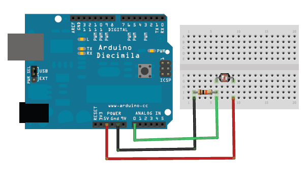

# Get analog value of light sensor

## Montage



## Code

```java
/*
  Get analog value of light sensor

  On récupère la valeur d'un capteur de lumière, et on l'affiche dans le moniteur série

  Extrait de :
  http://www.arduino.cc/en/Tutorial/AnalogReadSerial
*/

// La fonction setup() est exécutée au lancement de la carte Arduino (une seule fois)

void setup() {
  // On initialise la communication à 9600 bits par seconde
  Serial.begin(9600);
}

// La fonction loop() est exécutée en boucle, indéfiniment

void loop() {
  // On récupère la valeur analogique de notre pin (donc de notre capteur de lumière)
  // et on la stocke dans une variable `sensorValue`
  int sensorValue = analogRead(A0);
  
  // On affiche cette valeur dans le moniteur série
  Serial.println(sensorValue);

  // On laisse un délai de 1 milliseconde 
  // pour que la carte Arduino ne s'emballe pas
  // (stabilité des données envoyées/reçues)
  delay(1);
}
```