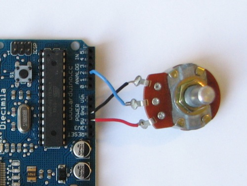

# Get analog value of potentiometer

## Montage



## Code

```java
int potPin = 2; // Numéro du pin du potentiomètre
int val = 0;

void setup() {
  Serial.begin(9600);
}

void loop() {
  val = analogRead(potPin);
  Serial.println(val);

  delay(50); // On ajoute un délai pour stabiliser l'envoi répété des données
}
