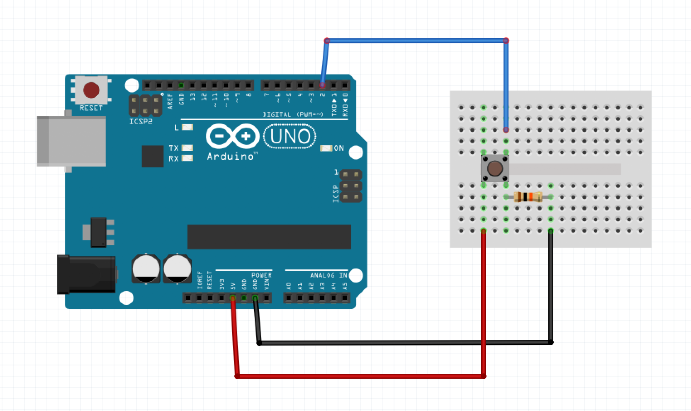

# Get digital value of button

## Montage




## Code

```java
/*
  Get digital value of button

  On récupère la valeur d'un bouton, et on l'affiche dans le moniteur série

  Extrait de :
  http://www.arduino.cc/en/Tutorial/DigitalReadSerial
*/

// On définit ici le numéro du pin sur lequel est connecté le bouton
int pushButton = 2;

// La fonction setup() est exécutée au lancement de la carte Arduino (une seule fois)

void setup() {
  // On initialise la communication à 9600 bits par seconde
  Serial.begin(9600);
  
  // On définit le pin comme étant une valeur à recevoir (INPUT)
  pinMode(pushButton, INPUT);
}

// La fonction loop() est exécutée en boucle, indéfiniment

void loop() {
  // On récupère la valeur digitale de notre pin (donc de notre bouton)
  // et on la stocke dans une variable `buttonState`
  int buttonState = digitalRead(pushButton);
  
  // On affiche cette valeur dans le moniteur série
  Serial.println(buttonState);

  // On laisse un délai de 1 milliseconde 
  // pour que la carte Arduino ne s'emballe pas
  // (stabilité des données envoyées/reçues)
  delay(1);
}
```