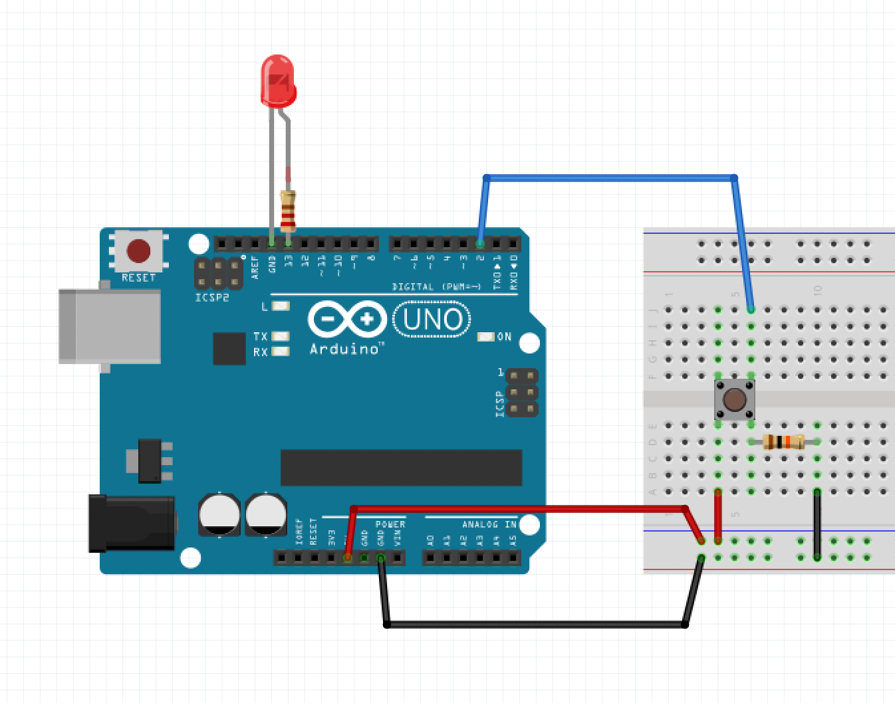

# Toggle LED with button

## Montage



## Code

```java
/*
  Switch LED with button

  Allume ou éteint une LED lorsqu'un bouton est pressé.

  Extrait de :
  http://www.arduino.cc/en/Tutorial/Button
*/

// On définit les numéros des PIN concernés
const int buttonPin = 2;     // Le numéro du PIN du bouton
const int ledPin =  13;      // Le numéri du PIN de la LED

// On crée une variable qui stockera l'état du bouton (appuyé ou relâché)
int buttonState = 0;

void setup() {
  // On définit le PIN de la LED comme une valeur à envoyer (on va éclairer ou éteindre la LED)
  pinMode(ledPin, OUTPUT);

  // On définit le PIN du bouton comme une valeur à récupérer (quand on appuiera ou relâchera le bouton)
  pinMode(buttonPin, INPUT);
}

void loop() {
  // On stocke l'état actuel du bouton
  buttonState = digitalRead(buttonPin);

  // On vérifie l'état du bouton :

  // Si le bouton est HIGH
  // donc qu'il a un voltage maximal
  // donc qu'il est actuellement appuyé :

  if (buttonState == HIGH) {
    // On allume la LED
    digitalWrite(ledPin, HIGH);
  }

  // Sinon, si le bouton n'est pas HIGH
  // donc qu'il n'a pas le voltage maximal
  // donc qu'il est actuellement relâché :

  else {
    // On éteint la LED
    digitalWrite(ledPin, LOW);
  }
}
```
